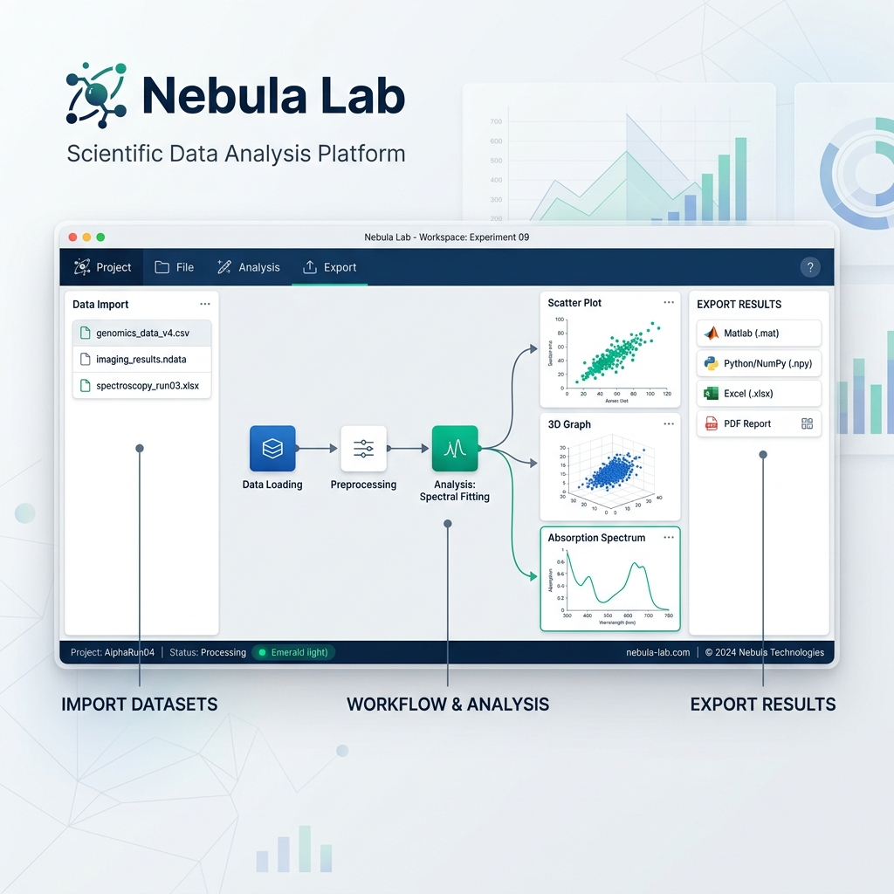

# Nebula Lab

**A Windows desktop workstation for scientific data preparation, batch execution, and Origin-ready export**

From raw experimental files to plot-ready datasets, Nebula Lab keeps import, grouping, cleansing, batch processing, and export in one workflow.

[🇨🇳 简体中文](./README.md) · [🇺🇸 English](./README_EN.md)

[**📥 Download Latest Release**](https://github.com/TshyGO/NebulaLab-Releases/releases/latest) &nbsp;&nbsp;•&nbsp;&nbsp; [**📄 View Release History**](https://github.com/TshyGO/NebulaLab-Releases/releases)

  

> **What Nebula Lab is for:** a stable, repeatable workflow for group-level data and multi-plot experimental series, reducing repetitive manual cleanup before handoff to Origin or other plotting tools.

## Workflow Overview

| Import | Group | Cleanse | Batch Process | Preview | Export |
| :--- | :--- | :--- | :--- | :--- | :--- |
| `.csv` `.txt` `.xlsx` | Organize by folder, group, or sample set | Crop, normalize, and handle outliers | Reuse pipelines across homologous datasets | Inspect trends and processed distributions | Export to Origin / `.opju` |

## Core Capabilities

| Capability | Description |
| :--- | :--- |
| Preprocessing First | Standardize data quality and structure before formal plotting to reduce downstream rework. |
| Group-Level Reuse | Apply a validated workflow from one sample to an entire related dataset group. |
| Independent Branch Control | Let anomalous samples leave the main pipeline and follow a separate logic path. |
| Local Desktop Execution | Run as a standalone Windows application so raw experimental data stays on local hardware. |

## Typical Usage

1. Download the `setup.exe` or `msi` package from the [Releases page](https://github.com/TshyGO/NebulaLab-Releases/releases/latest).
2. Import instrument outputs, wide tables, or grouped experiment result files.
3. Configure cleansing, cropping, normalization, or interpolation rules for the active dataset group.
4. Use the visualization module to verify that the processed output looks correct.
5. Export the prepared grouped data to Origin or other scientific plotting tools.

## Package Notes

> Supported systems: Windows 10 / Windows 11 (x64)

| Package | Best For | Description |
| :--- | :--- | :--- |
| `NebulaLab-*-setup.exe` | Standard desktop installation | Recommended for most users, with the regular installer flow and updater support. |
| `NebulaLab-*.msi` | Managed or large-scale deployment | Better for lab workstations, domain-managed environments, or silent deployment scenarios. |

> Files such as `.sig` and `latest.json` are internal updater assets and can be ignored during manual installation.

## Roadmap Focus

- Workflow template sharing and discovery
- Smarter data-structure recognition and cleansing guidance
- Richer OriginLab interoperability and export support
